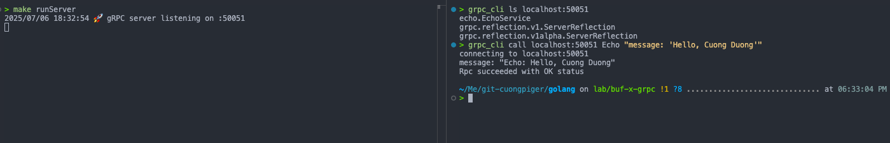
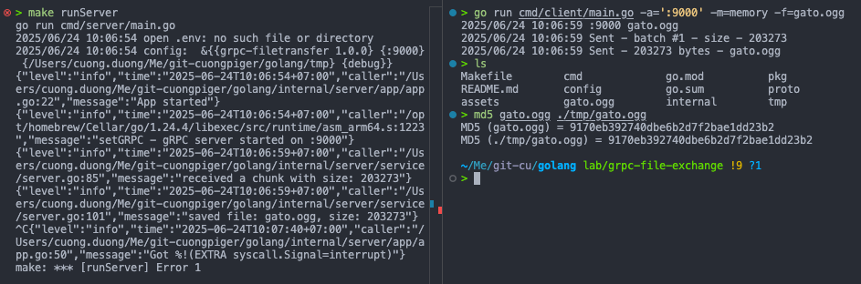

###### [_↩ Back to `main` branch_](https://github.com/cuongpiger/golang)

<hr>

# gRPC file transfer

## Server

- To run the server, execute the following command:

```bash
make runServer
```

- Server config ./config/server/config.yml or you can use envs.

## Client

- To run the client, execute the following command:

```bash
go run cmd/client/main.go -h
Sending files via gRPC

Usage:
  transfer_client [flags]

Flags:
  -a, --addr string    server address
  -b, --batch int      batch size for sending (default 1048576)
  -f, --file string    file path
  -m, --method string  transfer method (file/memory) (default "file")
  -h, --help           help for transfer_client
```

- File transfer speed depends on batch size

## Client run

- To run the client with a specific file, use the following command:
  ```bash
  # Using file transfer method
  go run cmd/client/main.go -a=':9000' -f=gato.ogg

  # Using memory transfer method
  go run cmd/client/main.go -a=':9000' -m=memory -f=gato.ogg

  ```
  - The `file` method:
    

  - The `memory` method:
    