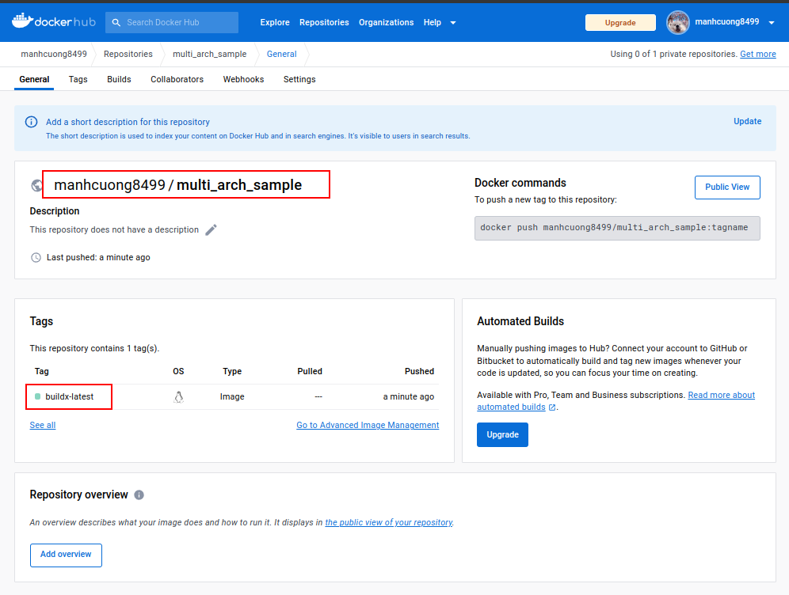
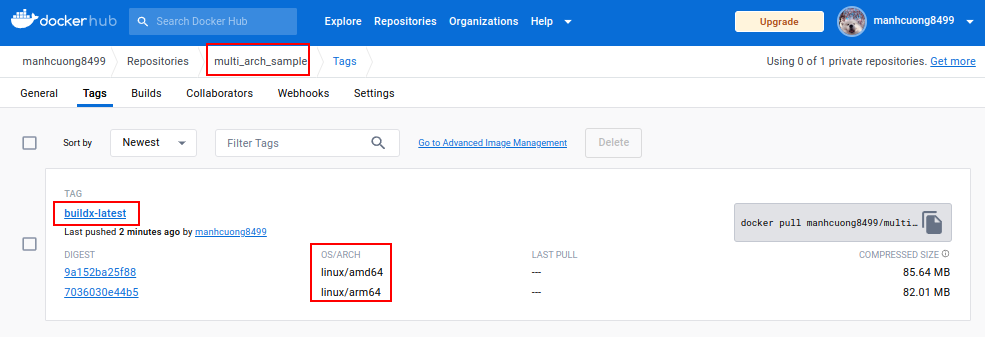

###### [_↩ Back to `golang@main` branch_](https://github.com/cuongpiger/golang)
###### [_↩ Back to `cloud@main` branch_](https://github.com/cuongpiger/cloud)
<hr>

###### References
- [https://www.docker.com/blog/how-to-rapidly-build-multi-architecture-images-with-buildx](https://www.docker.com/blog/how-to-rapidly-build-multi-architecture-images-with-buildx/)

<hr>

- **Buildx** is used to build container images for multiple architectures in parallel.
- This is my simple demo to build a multi-architecture image for `golang` application.
- The below images are built by `buildx` and pushed to my Docker Hub account.
  
  
- To build the container image and then pushing them to the image registry, run the below command:
  ```bash=
  ./commands.sh build
  ```