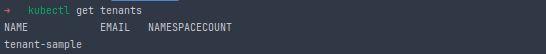

# Introduction & Environment Bootstrap

- **Step 1**: Init the golang project:
  ```bash=
  go mod init github.com/cuongpiger/golang
  ```

- **Step 2**: Init the `kubebuilder` scaffolding:
  ```bash=
  kubebuilder init --domain cuongpiger.io --repo github.com/cuongpiger/golang
  ```

- **Step 3**: Create the `Tenant` API:
  ```bash=
  kubebuilder create api --group multitenancy --version v1 --kind Tenant
  $ Create Resource [y/n]
  y
  $ Create Controller [y/n]
  y
  ```

- **Step 4**: Generate the CRD and Controller:
  ```bash=
  make manifests
  ```

- **Step 5**: Install the CRD into the cluster:
  ```bash=
  # export KUBECONFIG=<path_to_kubeconfig_file>
  
  make install
  ```

- **Step 6**: Apply the sample manifest for the `Tenant` CR:
  ```bash=
  kubectl apply -f config/samples/multitenancy_v1_tenant.yaml
  ```

- **Step 7**: Check the `Tenant` CR:
  ```bash=
  kubectl get tenant
  ```
  
  